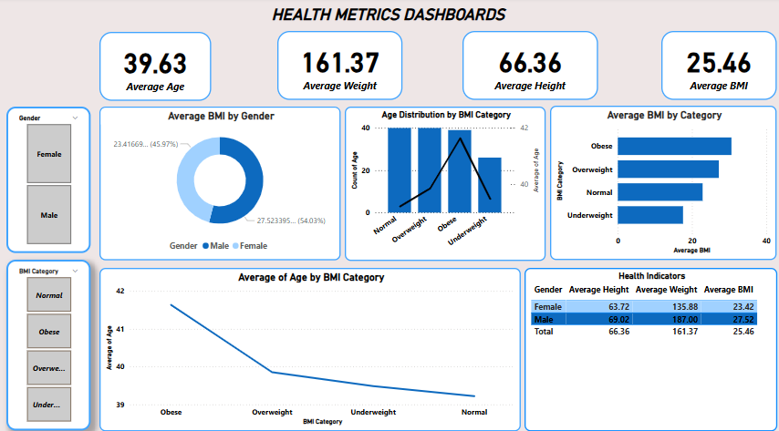

# health-bmi-analysis
An interactive Power BI dashboard visualizing health metrics like BMI, weight, height, and age by gender and category. Useful for exploring population health trends and generating data-driven insights.
# 📊 Health Metrics Dashboard

This Power BI report visualizes key health indicators based on BMI (Body Mass Index), age, weight, height, and gender. It provides insights into the distribution and averages of these metrics to help identify patterns across different BMI categories and genders.

---

## 🔍 Key Highlights

### Overall Averages:
- **Average Age:** 39.63 years  
- **Average Weight:** 161.37 kg  
- **Average Height:** 66.36 inches  
- **Average BMI:** 25.46  

---

## 📈 Visualizations Overview

1. **Average BMI by Gender**
   - **Male:** 27.52  
   - **Female:** 23.42  
   - Donut chart comparing BMI averages across genders.

2. **Age Distribution by BMI Category**
   - Count of individuals and average age across BMI groups: Normal, Overweight, Obese, Underweight.

3. **Average BMI by Category**
   - Horizontal bar chart showing BMI in the following categories:
     - Obese
     - Overweight
     - Normal
     - Underweight

4. **Average Age by BMI Category**
   - Line chart visualizing how average age changes with BMI categories.

5. **Health Indicators Table**
   - Gender-based summary:
     - **Female:** Avg. Age: 63.72, Weight: 135.88, BMI: 23.42  
     - **Male:** Avg. Age: 69.02, Weight: 187.00, BMI: 27.52

---

## 🎯 Purpose

This dashboard aims to help healthcare professionals and analysts:
- Understand how BMI varies by gender and age.
- Identify age trends in different BMI categories.
- Visualize population health metrics in an easy-to-read format.
